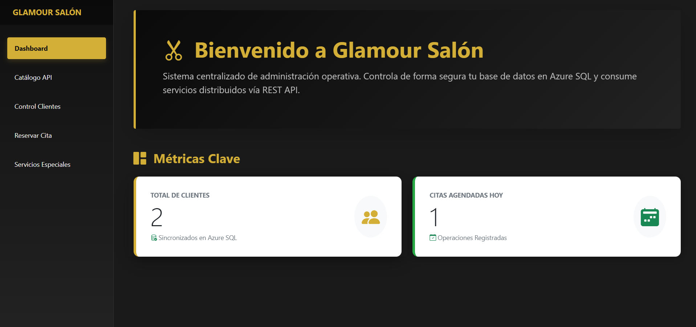
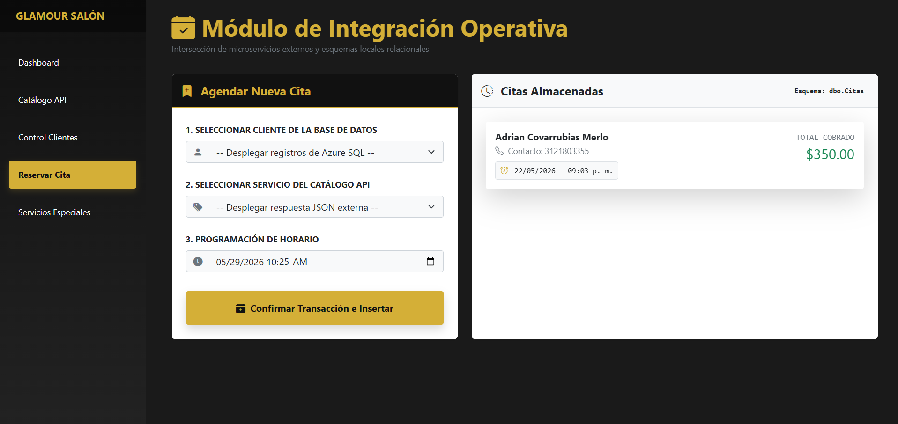
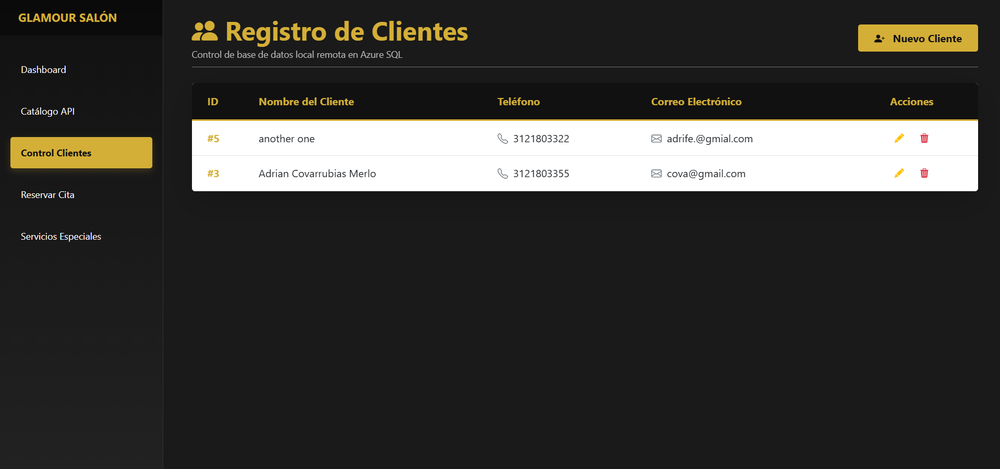

# 🏢 Glamour Salón & Estética — Sistema de Gestión Web
> **Desarrollado por:** Adrián Felipe Covarrubias Merlo
> **Numero de cuenta:** 20204423
> **Negocio asignado,:** Estetica/Salon
> **URL API,:** https://api-udec-pweb.azurewebsites.net

---

## 🤖 Declaratoria de Uso de Inteligencia Artificial (IA)

En cumplimiento con los lineamientos académicos del proyecto, se declara que se utilizó **Inteligencia Artificial (Gemini/LLM)** como herramienta de soporte y co-creación arquitectónica durante las fases del desarrollo de este software.

### 🛠️ Áreas en las que se implementó el uso de IA:
1. **Refactorización y Estilizado CSS:** Optimización y limpieza del archivo global `wwwroot/app.css` para aplicar de forma consistente la paleta de tres colores del proyecto y corregir problemas de colisión de estilos (iconos ocultos).
2. **Estructuración del Frontend en Blazor:** Soporte en la maquetación semántica basada en Bootstrap para lograr componentes responsivos y legibles en las 5 vistas del sistema.
3. **Mecanismo de Usabilidad (UX):** Apoyo en la lógica de control para el despliegue secuencial de los componentes flotantes (`Modal`) que gestionan los formularios de validación y la confirmación segura de eliminación física de registros.
4. **Redacción de Documentación Técnica:** Soporte en el formato y orden estructural Markdown de este archivo de documentación para garantizar la entrega formal de la rúbrica.

*Nota: Toda la lógica de persistencia de datos (Entity Framework Core), las credenciales de conexión remota a Azure SQL Database y las llamadas asíncronas HTTP al servicio REST API institucional fueron configuradas, probadas y validadas manualmente por el autor de este proyecto, asegurando el control total y entendimiento del backend de la aplicación.*